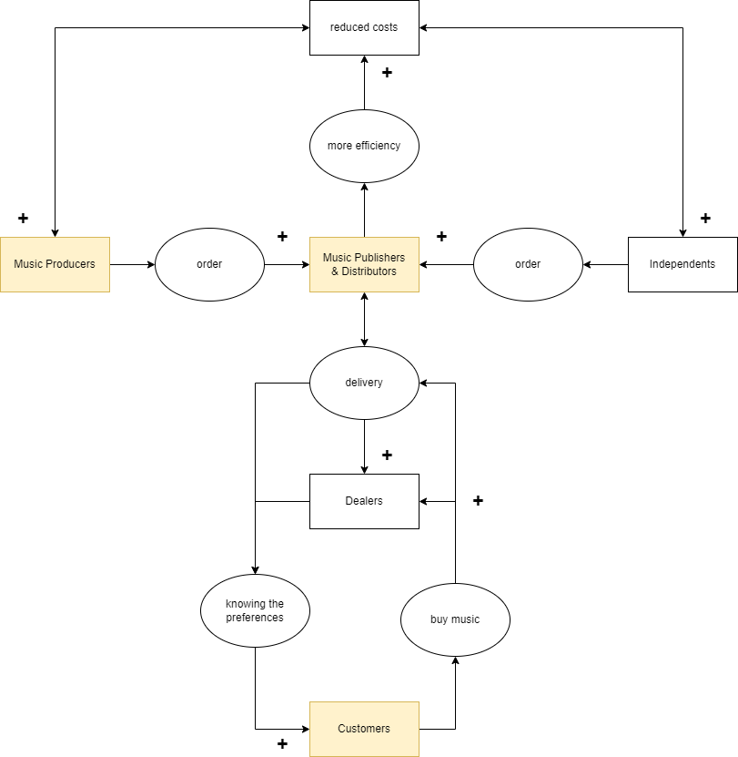
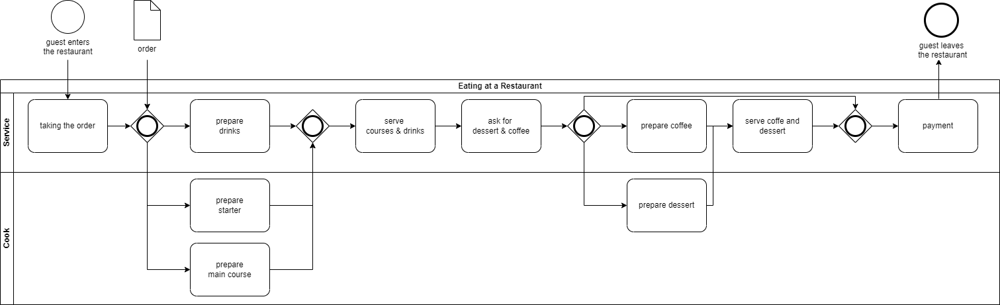
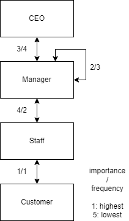
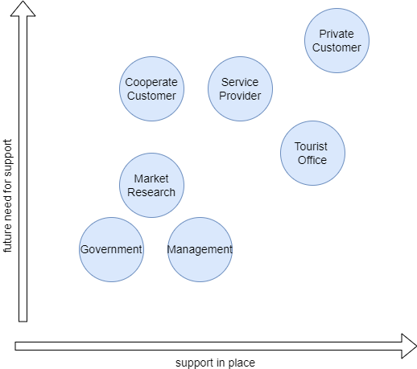

# Case Studies

## Case Study Business Logic: CDNet
Stakeholders in the project CDNet:

| **Stakeholder** 	                | **Objectives** 	             | **Influencing factors** 	    | 
|-----------------	                |----------------	             |-------------------------	    |
| _Music Producers_                 | High volume at low price       | Efficient settlement process |
| _Music Publishers & Distributors_	| Offering low prices            | Technical improvements      	|
|                               	|                                | Building a plattform      	|
| Dealers        	                | Know the customers             |                          	|
| _Customers_      	                | Good experience at low price   |                          	|

From the stakeholders the business logic can be derived.

The role and potential of digitisation is enormous. The goal of CDNet should be to build a streaming platform that meets the following needs:

- Music producers could record their music with little effort and in high volumes and upload it to the platform
- Music could be sold directly to the customer (B2C) instead of using retailers as middlemen
- Data from customers could be collected to make direct sales suggestions to customers. In addition, the data could be analysed as a whole and sold to music producers.

The disadvantage would be the big competition (Apple Music and Spotify). Therefore, the selection of a suitable business model and appropriate marketing is crucial.

## Case Study Organisational Model: Peclard

Core process of Peclard:  

__Delivered Service:__ a dinner at one of Peclards' restaurants  
__Used Technology:__ a tablet to take the order and a screen to see the pending orders in the kitchen  
__Initiator:__ the customer enters the restaurant  
__Controlling:__ waiter:ess  
__All involved staff roles:__ waiter:ess, chef

Since each restaurant of Peclard provides the same core service, it would make sense to have a similar hierarchical, product line-based structure in each restaurant. Staff are trained according to the restaurant's speciality, i.e. courses and upscale service. Nevertheless, staff could be exchanged within reasonable limits.

Geographical parameters determine the frequency of information exchange. Exchanges within the restaurant are more frequent than between management, although the importance is not necessarily higher.

Digitalisation could help the restaurant in various ways. On one hand smart systems could track order and therefore optimize purchases. On the other hand, communication between restaurant managers could be facilitated and schedules could be shared to find potential temporary staff.

## Case Study Content Strategy: Swiss Tourism

Switzerland Tourism (ST) is an information company whose main objective is to offer high-quality marketing programmes and stimulate demand for offers in Switzerland and abroad. Therefore they require an well thought-out information management.

__Stakeholdergroups__:

- The government: Principal, wants to stimulate tourism demand in order to generate tax revenue
- Private customers: Need information about travel and holiday offers
- Service providers: Place their offers on a central and attractive platform
- Corporate customers: Need offers for the organisation of events and congresses
- Information centres: Act as a regional information hub
- ST management: The aim is to provide the desired information in high quality and at the lowest possible cost
- ST market research: Determine the tastes of the most important customer groups. Keeping knowledge up to date
- ST IT: Provide a stable and robust information platform

The current supply of support and the future need for support are in a linear relationship with each other - which suggests that ST is working well. The government has the lowest demand and supply, as it only needs to keep an eye on its investments. The greatest emphasis is placed on private customers. Cooperate customers and market research user groups could be further strengthened, while the role of tourist information centres will diminish as digitalisation progresses.

__Information needs__:

c) Show how you derive the need for information. Make assumptions.

Information requirements:
	- For what purposes is information needed?
	- What's the value of information to fulfill the business case?
Which information is associated with a directcompetitive advantage

