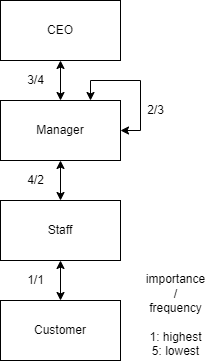
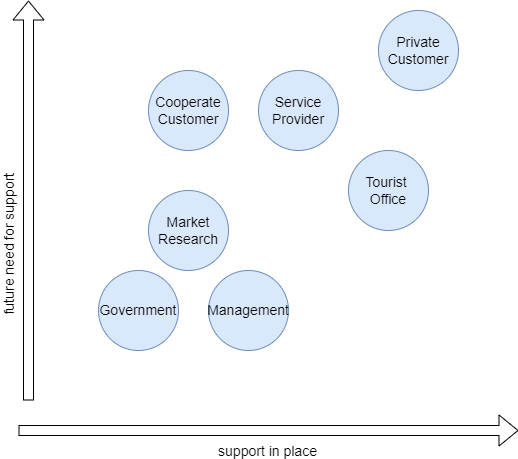

# Case Studies

## Case Study Business Logic: CDNet
Stakeholders in the project CDNet:

| **Stakeholder** 	                | **Objectives** 	             | **Influencing factors** 	    | 
|-----------------	                |----------------	             |-------------------------	    |
| _Music Producers_                 | High volume at low price       | Efficient settlement process |
| _Music Publishers & Distributors_	| Offering low prices            | Technical improvements      	|
|                               	|                                | Building a plattform      	|
| Dealers        	                | Know the customers             |                          	|
| _Customers_      	                | Good experience at low price   |                          	|

From the stakeholders the business logic can be derived.

The role and potential of digitisation is enormous. The goal of CDNet should be to build a streaming platform that meets the following needs:

- Music producers could record their music with little effort and in high volumes and upload it to the platform
- Music could be sold directly to the customer (B2C) instead of using retailers as middlemen
- Data from customers could be collected to make direct sales suggestions to customers. In addition, the data could be analysed as a whole and sold to music producers.

The disadvantage would be the big competition (Apple Music and Spotify). Therefore, the selection of a suitable business model and appropriate marketing is crucial.

## Case Study Organisational Model: Peclard

Core process of Peclard:  

__Delivered Service:__ a dinner at one of Peclards' restaurants  
__Used Technology:__ a tablet to take the order and a screen to see the pending orders in the kitchen  
__Initiator:__ the customer enters the restaurant  
__Controlling:__ waiter:ess  
__All involved staff roles:__ waiter:ess, chef

Since each restaurant of Peclard provides the same core service, it would make sense to have a similar hierarchical, product line-based structure in each restaurant. Staff are trained according to the restaurant's speciality, i.e. courses and upscale service. Nevertheless, staff could be exchanged within reasonable limits.

Geographical parameters determine the frequency of information exchange. Exchanges within the restaurant are more frequent than between management, although the importance is not necessarily higher.

Digitalisation could help the restaurant in various ways. On one hand smart systems could track order and therefore optimize purchases. On the other hand, communication between restaurant managers could be facilitated and schedules could be shared to find potential temporary staff.

## Case Study Content Strategy: Swiss Tourism

Switzerland Tourism (ST) is an information company whose main objective is to offer high-quality marketing programmes and stimulate demand for offers in Switzerland and abroad. Therefore they require an well thought-out information management.

### Stakeholdergroups

- The government: Principal, wants to stimulate tourism demand in order to generate tax revenue
- Private customers: Need information about travel and holiday offers
- Service providers: Place their offers on a central and attractive platform
- Corporate customers: Need offers for the organisation of events and congresses
- Information centres: Act as a regional information hub
- ST management: The aim is to provide the desired information in high quality and at the lowest possible cost
- ST market research: Determine the tastes of the most important customer groups. Keeping knowledge up to date
- ST IT: Provide a stable and robust information platform

### Support needs

The current supply of support and the future need for support are in a linear relationship with each other - which suggests that ST is working well. The government has the lowest demand and supply, as it only needs to keep an eye on its investments. The greatest emphasis is placed on private customers. Cooperate customers could be further strengthened, while the role of tourist information centres will diminish as digitalisation progresses.

### Information needs

The information requirements are different for each stakeholder. Customers want to know the portfolio on offer. Providers want to be associated with discerning customers. The state wants to be promoted to tourists and companies. Management wants the necessary marketing information to gain insights into customer tastes and thus promote Switzerland attractively. 

The most important information for assessing the success of ST is financial information such as bookings, ticket sales as well as operating, maintenance and development costs of the platform. With that information it can be assesed wheter ST managed to boost tourism in Switzerland.

Information that leads to a competitive advantage (compared to other countries) is marketing information. This information allows ST to apply a sophisticated marketing strategy that leads to an increased appreciation of Switzerland.

## Case Study Information Management: Coop vs. Migros

### Information Cultures
Migros and Coop exhibit open information cultures that emphasize collaboration, transparency, and sustainability. They promote open communication, where Migros rotates executive staff between departments and in the case of Coop they released the 'myCoop' app for cross-departmental information access. Both companies maintain a balanced internal and external focus, optimizing supply chain and cost control internally, while externally focusing on market research and customer satisfaction. Both companies are predominantly fact-based, as they rely on operational efficiency and data analysis for inventory management and customer behavior understanding. On the other hand, they also recognize the importance of intuition in fostering innovation for their product lines and ensuring quick responses to emerging trends or customer shifts, which is crucial in the dynamic retail sector.

### Information Principles
Coop's Supercard and Migros' Cumulus, both credit cards and loyalty programs, share similar operating principles. They employ a combined information orientation, focusing on both the content and process of customer purchases, and utilize schematizing information management to create customer profiles. In terms of data ownership and security, they follow a combined strategy, sharing data within subsidiaries while excluding external access, and leaning towards the necessity principle in legal obligations. Both companies prioritize high standards in information privacy, with aligned practices such as retaining customer data for the maximum legal duration and emphasizing internal data exchange over external sharing.

The role of customer data for Coop and Migros is central, shaping personalized promotions. It explores information principles, emphasizing that the acquired data is vital for business operations and should not be outsourced. The goal is to enhance user profiles, and any potential data sale should be approached with caution, limited to isolated topics, and carefully considered for broader implications.

### Insource or Outsource the procurement of Customer Data
The procurement of data acquired through Cumulus and Supercard comes with almost no additional cost and constitutes the core of essential knowledge for the fundamental operations of the business and, under no circumstances, should it be outsourced.
The acquisition of data is meant to enhance user profiles, and any potential sale of data should be approached with utmost caution, limited to isolated topics and with careful consideration of its broader implications.

### Derivation of Customer Segment Information

Deriving customer segment information involves collecting, integrating, and analysing data to identify common characteristics and behaviours. Data is gathered from various sources like interactions, transactions, surveys, and social media, then cleaned and validated for accuracy. Segmentation criteria are defined, and analysis tools group customers based on patterns. Seg-ments are validated, and detailed profiles are created for customization. Migros uses its app to collect data from loyalty cards, online interactions, surveys, and external sources, employing segmentation, profiling, predictive modelling, and customer journey mapping for personalized marketing, product development, store optimization, and customer engagement, gaining a competitive retail advantage.

## Case Study Information System Strategy

In this case study I analyzed the platform [jobs.ch](https://www.jobs.ch/en/).
The main task of the platform is placement office. The main stakeholders are employees, recruiters and coorporates. An additional service is the comparison of salaries.

### Overview
__Quantity Structure__: The data as a placement centre is of more ephemeral interest. What is interesting are the patterns in the mass of data i.e, industry trends, market for specialized staff, salary insights, demographic and geographic patterns.  
__Security__: CVs contain personal data and is confidential and must be protected.  
__Autonomy__: Data can be handled autonomous as long as privacy is ensured.  
__Distribution__: As the main product is a webapplication the data must be centrally stored.  
__Flexibility__: The system must be designed with modern technology to guarantee the effectiveness and efficiency for the users.

### Information System Architecture
The following image shows the architecture of a recruitment system architecture:

Source: https://www.researchgate.net/figure/Online-recruitment-system-architectural-design_fig7_354866877

From this architecture the following can be derived:
#### Information Map
__User__: 
- Has an overview of his personal information in his profile
- Can query APIs to obtain interesting job offerings
- Can open chats with AIs or the service desk

__Recruiter__:
- Has an overview over the vacant positions of the company
- Can create job offerings
- Can open chats with AIs or the service desk
- Can search for potential candidates (payed service)

__IT Admin__:
- Has an overview of the infrastructure
- Can manage the different systems (WebApp, APIs, Databases...)

__Service Desk__:
- Overview of the incidents
- Receives new incidents via the chat function
- Tracks and solves the incidents

The communication channels are mostly asynchronous (via platform) the only synchronous channel is if a user or recruiter gets connected with the service desk via chatting functionality.

From the information map and the system architecture the following requirements for the system can be derived:

### Conclusion
A robust recruitment platform integrates the most important information systems for seamless end-to-end recruitment. This includes a central database and various post and query endpoints. The integration of analytics tools enables the tracking of recruitment metrics for optimisation. A mobile application improves accessibility and compliance features ensure adherence to regulations. Integration of CRM for candidates and AI algorithms improves candidate matching, utilising robust security measures. Feedback systems contribute to continuous improvement and user training ensures effective utilisation. Customisability and scalability support business growth and make the platform efficient, secure and user-friendly.