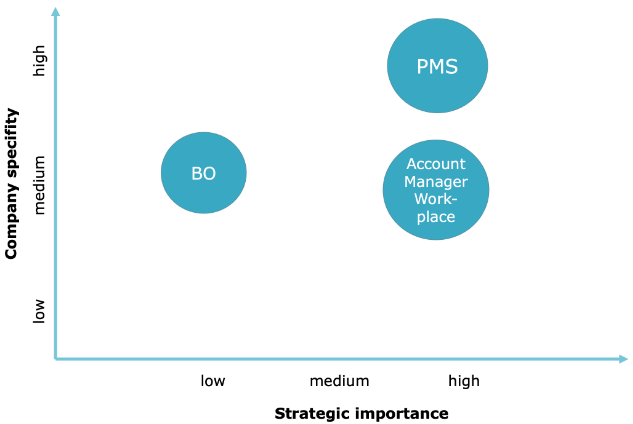

# DIGIBUMO
The aim of this journal is to account for the learning progress in the subject of digital business models.   

__The case studies can be found [here](./CaseStudies.md)__  
__The class review can be found [here](./SubjectReview.md)__

## Table of Contents  
- [Business Strategy](#business-strategy)
- [Organizational Model](#organizational-model) 
- [Content Strategy](#content-strategy) 
- [Information Management](#information-management)  
- [Information System Strategy](#information-system-strategy)
- [Used Material](#used-material)

## Business Strategy
Develop a business strategy that includes the following aspects:

- Management
- Processes
- Information flow
- Resources and use of technology

To achieve this, the following steps must be taken:

__1. Analyse the initial situation__  

Check the preconditions for a smooth transformation process:

- Is the company stable or in transition?
    - Stable: Previous business model taken into account
    - In transition: previous business model is less taken into account
- Is management willing to make organisational changes to improve the information process?
- Which managers and experts should be selected to support the business strategy development process?

__2. Elaborate the business vision and mission__  

Clarifying the vision of the organisation's function within its environment. To achieve this, the following aspects need to be analysed:

- Industry knowledge, political environment
- Strengths and weaknesses of the organisation
- Uncovering critical success factors
- Stakeholders, their views, expectations and needs.    
    Categorise the relevance, potential and urgency for each stakeholder

Develop an appropriate vision that meets the following criteria:
- Name unique selling propositions (USPs) for the company.
- The mission must be achievable within several years
- The vision is customer-oriented
- Stakeholders are taken into account

__3. Model the business logic__  

Review the corporate vision and identify critical success factors. Evaluate the indicators to measure the company's performance.

To achieve these goals, it is best to model the flow of information with system dynamics:

- Start with the previously identified stakeholders and their goals.
- Find positive and negative influencing factors for achieving the goals.
    Evaluate the following points for each influencing factor:
    - Influenceability - how can it be influenced?
    - Measurability - how can it be measured?
    - Interdependence - how does it influence other factors?
    - Optional: Importance - add weighting

Repeat this process until the following criteria are met:
- All stakeholder perspectives are considered.
- Identify the central loop: it consists of positive influencing factors that capture the basic functioning of the company.
- Identify the stabilising factors: loops consisting only of positive influencing factors or only of negative influencing factors must be stabilised by factors with the opposite sign.

The following aspects can be derived from this diagram:
- Critical success factors: positive factors of the central loop or have a positive effect on many other influencing factors.
- Key Performance Indicators (KPIs): These measure the critical success factors.
- Risks: critical success factors that cannot be sufficiently influenced.
- Necessary tools: to address and manage the identified risks.

Set realistic targets for all KPIs and implement the identified tools in the system model.  
The final result forms the basis for developing appropriate corporate governance: Products and core processes, staff roles, core competencies and promotion, and the process structure.

__4. Describe products and core processes__  

_Products_ are derived directly from customer needs and technical possibilities. It must always be checked whether there is a sufficient standardised solution on the market that meets the problems or whether it is necessary to produce it oneself.
The following information must be recorded for each product:

- Product name
- Customer needs covered
- Required technology
- Related core process
- Use of information (coordination or operation)
- Product life cycle
- Current phase in the product life cycle

Products are independent influencing factors in the system model. To ensure that a product is feasible, its relationship to the critical success factors must be closely examined. Together with the resource requirements for development and operation, the priority/value of the product can be derived.

_Core processes_ are the chains of activities related to a product or service that must be performed from the formulation of a customer order to the completion of the order.
The following information must be tracked for all core processes:

- Process name
- Necessary activities
- Core competences for the execution

__5. Define necessary roles and competences__  
A list of necessary competences can be derived from the products and core processes. These competences can be collected and grouped into roles in a meaningful way.  Attributes should be recorded for each role:

- Name of the role
- Core competencies
- Development opportunities

## Organizational Model

The operational structure has to be aligned with the business logic but in a process perspective. The organizational model is derived from the core processes, the core competences and the staff roles.

__1. Define process-structures__  
A process definition includes:

- Designation of the product/service to be delivered
- Required technology, information and resources
- Responsibility for initiating and controlling the process
- All staff roles involved

Process flows change with the product life cycle and experience gained and therefore need to be flexible and adaptable.  
At the beginning: A low level of firmly defined activities and dependencies is typical.  
At the end of the life cycle: High quantities must be handled as cost-effectively and quickly as possible. Efficient organisational forms therefore become a critical success factor that requires a high degree of structuring.

__2. Define organisational structure__   
Based on the developed business logic, the most appropriate organisational structure must be found. Responsibilities, management structure and information flows need to be defined.

Flat hierarchies have a higher need for information distribution, while in hierarchical structures the flow of information is easier to define. Normally, specific knowledge is built up in the organisational units, while management information flows along the relationships between superiors and subordinates within the organisation.
There is a variety of organisational superstructures to chose from:

- Product line-based structure: the product line can be clearly delineated from the customer's perspective.  
- Stakeholder-based structure: relationships with stakeholders are a critical success factor.
- Competence centre-based: knowledge development is a critical success factor or competences can be reused in a worthwhile way.

Working groups are temporary associations of experts to deal with specific, infrequent problems. The efficient formation of working groups is very important for the success of a company and should be taken into account when planning the organisational structure. In addition, the prevailing corporate culture should not be changed too abruptly.

__3. Define the spatial organisation__   
The spatial organisation ensures communication flows and estimates its importance and frequency between organisational units and stakeholders.  

Communication flows can be modeled and weighted:

Based on this diagram, communication can be coordinated and facilities can be created to meet the respective needs.

## Content Strategy

Information can be used to create value outside the organisation and reduce costs within the organisation through communication, coordination and simulation. Value can be created through the creation of new opportunities, better utilisation of resources and better assessment of risks. The leverage effect of information can also be utilised by storing the information as knowledge within the company if the same data can be used multiple times.  
Information is also needed to recognise changes in the environment and to make appropriate adjustments within the company. Adjustments can be made by selecting alternative needs, processes, technologies, personnel, management, use of resources, and so on. Information can therefore increase the flexibility of the organisation.

In order to organise a company accordingly, the vision and business logic must be examined from an information perspective with regard to the influence of the following factors:

- Management information
- Operational information
- Project information
- Innovation

Information must be collected through a well thought-out process. Value is created through the utilisation of this information.

### Positioning of information, organisation and IT

Assess the type of information exchanged, its relevance, its potential and its urgency for each stakeholder.
Based on this assessment, the current situation in terms of organisation, information and IT can be clarified. Further assess the current competence in the respective area and its future relevance. The future steps for achieving the necessary competences can be derived from these findings.

### Information objectives

The aim is to define objectives for each stakeholder group with regard to the information required and the utilisation of IT.

Based on the previous analysis, the user groups must be defined and it must be determined whether they have an appropriate level of support in order to optimally utilise their information and information systems. In conjunction with the willingness to use systems, a prioritisation list can be drawn up. 
A high priority can be achieved by a combination of a high need for support, a lack of support in place and a high willingness to co-operate.

### Activity in data markets

Reasons for buying data:

- No core expertise can be lost
- The required data is not automatically generated as part of normal business activities
- The data can be procured more cheaply on the data markets than internally (cost of aquiring, storage and maintenance)

Reasons to sell data:

- There is an attractive market for the data
- Selling data plays a role as a strategic business area 
- The data can be procured internally at very low cost
- The sale does not jeopardise the company's competitive advantage

### Information needs

In this step information importance and the respective needs of the company must be clarified.

In practice the requested, needed and offered information is never completly overlapping.
Possible causes of deviations between information requirements and data supply:

- Process errors and process gaps (i.e. incorrect process structures or lack of communication)
- Data gaps leads to misinterpretations and higher risk for wrong decisions
- Flood of data due to an unsuitable pre-selection

To avoid these gaps, the information requirements must be defined. To achieve this, the following questions must be applied to the business strategy and the organisational model:

- For what purposes is the information needed?
- What information is needed to fulfil the business case?
- How and where can the information be used to create value?
- What information is associated with a direct competitive advantage?
- Is the value created greater than the cost of acquiring the information?
- How long will the information be relevant?
- What risks need to be considered?

Communication and information related and needed to adjust the business strategy and the organisational model is focused on effectiveness.  
The following types of informations are relevant:

- __Strategy information__: Concepts, business status and business development, trend analyses, market research results, competitor information, industry comparisons, projects, investments, unused financing potential, investment priorities, residential construction, effectiveness of intermediaries, political influences, general economic situation
- __Project information__: Project planning & status, use of resources, participants, responsibilities, absences, pending issues, project experience, project news, competitive information, project objectives, customer requirements, competitive information relating to the project
- __Daily business information__: Utilisation and deployment of resources, responsibilities, employee expertise, areas of interest, absences, pending issues, news/updates and management information, problem information, billing information and other relevant domain specific information
- __Employee information__: Participation in projects, responsibilities, absences, pending issues, core competences, qualifications, additional training, salaries
- __Relationship information__: Contacts, addresses, needs, services used, attractiveness, core competences, duration of relationship, intensity, responsible account manager
- __Offer information__: Products and service portfolio, prices, contracts, schedules, contacts
- __Customer information__: distributed via strategy information, offer information and relationship information

### Validation
To validate all previously take steps, undertake an in-depth profitability test of the business model. 

Furthermore answer the following questions:

- Is the business model easy to understand and does it address the company's core issues?
- Is a clear position defined in relation to the business, technology and data markets?
- Are the business mechanism and management of the business defined
- Is appropriate innovation ensured?
- Are product life cycle considerations in place? 
- Is there an overall product lifecycle balance across the product strategy? 
- Does information increase the value of products and services?
- Are the concepts of business, organisation and information aligned? 
- Is the coordination between business management and core processes ensured? 
- Is clear direction, focus and importance in relation to the various elements of the business model are defined?
- Is the exchange of information promoted by a conscious room design, room allocation and office organisation?
- Are information objectives and information need clearly defined?
- Are all perspectives (management, processes, information, resources, use of technology and specific perspectives in relation to the business) present and considered?
- Is the planned change process realistic, i.e. is the new strategy compatible with the existing corporate culture or is the necessary cultural change realistic? 
- Are the necessary core competences available or can the core competences be built up in good time? 
- Are the minimum necessary resources available?
- Has the difference between organisation, information and technology always been made clear when developing the business model?
- Can a qualified manager be designated as responsible for the implementation? 
- Does he or she have the support of the entire management team? 

## Information Management
This step focuses on anchoring an information management process in the company. The image below visualizes the process.

### Information culture and policy
__Information culture__: behaviour of each individual in dealing with information  
__Information policy__: determines the information behaviour

Characteristics:
- __Open information culture__: promoting and rewarding the exchange of information
- __Closed information culture__: Only explicitly declared information may be passed on 
- __Internal information focus__: relatively closed information process
- __External information focus__: information goes beyond the boundaries of the organisation
- __Emphasis on facts__: Decisions must be consistent with acquired information, e.g. market prices
- __Emphasis on intuition__: decisions can be made based on the intuitions of experts

An open information culture is a prerequisite for a learning organisation and a knowledge management concept, but also harbours security risks.

The following organisational structures can implement such a culture:

__Information monarchy__: the monarch determines the entire information process, which leads to standardisation and efficiency. The process is suitable for small companies with one business unit. It harbours the risk of suppressing creativity and innovation.

__Information feudalism__: Managers control the information environments and processes of their departments. This structure is suitable for different products and customers. The construct offers a high degree of flexibility, but can also lead to difficulties in cross-divisional information management processes and cross-selling. This approach is the most common and often causes difficulties in IT development as each business unit has different requirements.

__Information federalism__: based on weakly centralised and strongly decentralised autonomy. Information federalism determines which information must be exchanged and standardises and regulates the corresponding processes, the rest is decentralised. Information federalism supports an organisation that is geared towards constantly balancing the interests of those involved.
It enables innovation and adaptation, but also harbours risks due to increased coordination effort and competence regulations.

__Information market__: based on demand and not on regulation. Important and heavily used data is still managed. This approach is highly efficient as it has a low overhead, but harbours the risk that important data will not be offered or requested and will therefore be lost.

In large companies, it is not easy to distinguish between centralised and decentralised competences and responsibilities. Instead, information management often has to be coordinated across several levels. The approaches of information federalism and the information market are suitable solutions for such a situation.

The means of information policy also include the role of the information broker, the selective dissemination of information and targeted information leaks. The task of the information broker is to promote the exchange of information where political or other negative conditions prevent direct exchange.

Difficulties in information behaviour:

__Information Sharing or hoarding__: Information needs to be categorised and shared horizontally or vertically, depending on the type of information.

__Information overload__: With digitalisation, the amount of data is growing, while the means for processing and interpreting the data are not growing to the same extent. When information is passed on, the format in which the recipient can use it must be taken into account. Data may only be passed on if the recipient does not yet have and know the data. This is referred to as deliberate data behaviour.

__Ambiguity of terms and content__:In day-to-day business, the meaning of a term can change within a business unit due to different knowledge assignments to that term. An organisation must strike a balance between the interchangeability of information and its specific applicability in a given situation to ensure that the relevant data is interpreted in the same way.

__Formulation of information needs__: Identify the relevant questions to formulate information needs.

In order to change the information culture, opinion leaders and affected functionaries must be persuaded to adopt compliant information behaviour. Discussing information systems can only promote information awareness.

Basic approaches to influence information behaviour are the appointment of a group to promote information exchange, job rotation, frequent meetings across organisational units. When applying the information market model, the costs of internal communication can be taken into account. However, this must be done at the level of the employees and be perceptible to them. In return, the valuable transfer of knowledge must be rewarded.

### Information rules
Define a framework to fulfil the information policy in relation to the following factors:

- __Information orientation__: Optimising the value of information at the lowest possible cost to the management process
- __Information management approach__: Handling of formal and informal information
- __Data ownership__: Define responsibility for data maintenance and distribution
- __Security principles__: Select security principles for the openness or closedness of information types
- __Privacy and data protection__: Governs usage and measurements to ensure compliance with privacy standards
- __Information sharing__: Determines the information to be provided and requested
- __Retention principles__: Life cycle of information - determines short and long-term importance

Example of information rules:

### Information processes
Information processes can be derived from the information requirements of the business strategy. As a basis, consider which information is generated by core, management or innovation processes and which additional processes are required. Determine which data is collected and how information is processed. Furthermore, the stakeholder groups, employee roles and particularly the business logic should be analysed.  
The analysis can be done using the following diagrams:

Information derivation diagram of a booking form:

Impact diagramm on guest age:

Information processes should be integrated into management processes to ensure the cycle of analysis, planning, implementation and control.

The following aspects should be taken into account for the technology used:

- Degree of structuring of the process and the data involved
- Responsibility and interests for the generation, collection, delivery, ownership and use of data
- Organisational and geographical origin
- Time factor for the value of the data, especially for the competition
- Time factor for information management: generation, updating and processing frequency and required duration

To ensure the utilisation of information, the following points should be taken into account:

- Linking the data with meaning and context in the desired form
- Prioritise in terms of time:
	1. business information
	2. management information
    3. innovation information

Information managment aspects for arbitrage transactions:

### Organisation of information management
Organisational approaches to information management:

- __Library__: Accessible, structured data storage
- __Record keeping__: Scheme-specific storage of information, e.g. accounting
- __Research__: variety of heterogeneous data sources
- __TV programme__: customer-oriented, well-presented content
	
The latter two are active approaches that involve summarising, enriching and adding context to the information. Information workers translate general data into business-specific information. Institutionalisation approaches for the information management function include extension, addition, fusion, integration, and hybrid models.

A key question is whether to acquire the necessary competences or to outsource them.  
Categorisation of tasks for in- or outsourcing:

| __Advantages__                                          | __Disadvantages__                                       |
|---------------------------------------------------------|----------------------------------------------------------|
| Cost benefits through economies of scale and standardisation | Risk of external sourcing of services (less influence, dependence on the supplier) |
| Quality advantage with standard services                 | Responsibility for solving tasks cannot be transferred |
| Less investment in areas that are not part of core competences | Increased planning and control effort                    |
| Less vertical integration and therefore less complexity  | Restriction to standardised solutions                    |
|                                                         | Loss of expertise due to migration of employees          |
|                                                         | Loss of common goals can put a strain on the partnership |

#### Monitoring information use and controlling information management
Information, information management and the instruments used must be appropriate and well harmonised. Controlling is the basis for achieving the desired information behaviour. The key performance indicator system developed as part of the business logic also forms the basis for systematically evaluating the information management function. It is an iterative process of analysis, planning, implementation, measurement and control.

__Effectiveness__ is the ability to produce a better result, one that delivers more value or achieves a better outcome.
__Efficiency__ is the ability to produce an intended result in the way that results in the least waste of time, effort, and resources

For efficiency, the aspects of usefulness, usability and utilisation must be optimised

Maturity level:
- __Unknown__: Non-repeatable, unspecified processes
- __Repeatable__: The process can be repeated by individual experienced employees, but is not specified or documented.
- __Defined__: The process is defined and documented and can be carried out if no difficulties arise
- __Managed__: Controlled/monitored &rarr; reactive. Problems can be recognised and rectified at an early stage
- __Optimising__: Continuous improvement through feedback mechanisms

### Validation

The key responsible managers actively participate in the categorisation and definition of information. The information requirements are discussed by the responsible managers in plenary meetings. The information policy is openly discussed. Responsibilities for information are clarified and openly discussed. Those responsible are aware of the value of
value of information. The skills and knowledge of employees are valued. The importance of the exchange of knowledge and information within the company is explicitly communicated. Information culture and corporate culture are harmonised. The company has clear rules for handling information. The necessary competences are recognised and
promoted. The desired information behaviour is defined, documented and also taken into account in reorganisations. The company promotes information behaviour and takes it into account in performance appraisals. Information behaviour is continuously monitored, evaluated and improved. It is part of the corporate culture to pass on information in a targeted manner and enriched with additional data. A generic process model is used for the most important information processes, with which they can be systematically analysed and continuously improved.

## Information System Strategy
This phase diverges from the business model and information management phases, relying less on workshops and more on interviews, surveys, and detailed discussions with specialists. The objective is to seamlessly integrate the business strategy and information management into the existing IT infrastructure while concurrently addressing challenges such as closing data gaps, reducing data flood, and ensuring the interpretability of data within the system.

### Data Overview, Process Overview, and Basics

Basic knowledge for developing the information system strategy needs to be gathered. An inventory of the existing information system environment is created and combined with the requirements from the business model and information management phases. The inventory aids in recognizing and eliminating data duplications through detailed analysis. Pragmatically, the inventory includes devices, network installations, system programs, standard programs, purchased and internally developed applications, databases and documentations.

Important parameters for information system strategy design:

- __Quantity Structure__: Determined by business nature and product life cycle, guiding resource allocation.
- __Security__: Defines protective measures for sensitive data areas based on principles from the information management phase.
- __Autonomy__: Derived from information policy, enabling independent development of areas.
- __Distribution__: Dependent on operations' spatial distribution and process flow structures, ensuring data availability where needed.
- __Structuring and Flexibility__: Varied based on a product's life cycle status, impacting data and process structure standardization.
- __Heterogeneity__: Acknowledges diverse structures resulting from different requirements and autonomously developed systems.

#### Data Map

__Data map__: Compiles and describes essential data sets for user accessibility. It serves as a standardized starting point for data searches, complementing the access structure.   
__Information map__: Individualised view of the relevant data for a user/role.

Basis for developing a data map:

- __Clarify Use__: Define objectives and user groups before starting data map development.
- __Define Entry Structures__: Align access structure with business questions, such as employee roles or process structure.
- __Define Descriptive Attributes__: Describe data sets based on fixed attributes for clarity.
- __Ensure Provision__: Determine tools, automation, and updating processes for data map development.
- __Use a Data Map__: Develop and introduce data maps using evolutionary prototypes, refining based on usage.
- __Monitor and Consider Utilization__: Track data utilization, update the map accordingly.

#### Access Structures
This step considers how data can be accessed and shared. The previously developed data map is incorporated into these considerations, emphasizing conceptual questions over technical implementation details.

A flood of data occurs when too much data is made available (bring principle) or when there is insufficient guidance in searching for data (fetch principle). Access structures must support both bringing and fetching data.  
Modern information utilization is characterized by flexibility, association, event-driven processes, overlapping views, and diverse structures. However, to ensure efficient system structures and consistent data storage, clear organization and redundancy avoidance are desirable. The challenge is to provide users with their desired view of information despite differing underlying data and system structures.

Synchronous communication allows precise coordination but may lead to a flood of media for the recipient. It should be used judiciously, considering coordination efforts.  While asynchronous communication poses coordination challenges, increasing the risk of data gaps or a flood of data.  
The sender must decide on authorizations, addresses, and attributes when storing data. The recipient defines data of interest through queries, receiving an overview first and the actual content upon request.  
This data transfer approach focuses on identical treatment of different communication media and standardized storage based on logical aspects. Success depends on appropriate addressing, queries, and questions. Conceptual considerations include determining collected data for company context, descriptive properties in the profile, addressing in the company, priorities, and authorization rules.

Various systems support communication in practice, and comparing them with the reference model reveals functionality and limitations and provide a basis for informed judgments.

### Development of the information system architecture
In this step, the focus is on the usability of data in terms of systems and information technology. Key considerations involve choosing the appropriate information technology for the company, aligning it with organizational forms, and ensuring it meets requirements without unnecessary complexity. The decision-making process involves observing the information technology market, analyzing potential technologies, and prioritizing based on attractiveness, own capabilities, and potential benefits. The following image displays an example of used technologies along the information process.

#### Information Technology Portfolio

The aims of the information technology portfolio is to determinine the suitable information technology to employ and establishing its priority. This includes the crucial task of aligning the chosen technology with the organizational requirements, steering clear of unnecessary complexities. Continuous observation of the information technology market is also imperative to stay abreast of developments.

When Analyzing Technologies, a comprehensive assessment is conducted. The attractiveness of a technology is gauged based on factors such as applicability, cost, future prospects, and compatibility. Simultaneously, an evaluation of the organization's capabilities is undertaken, considering investment requirements and expertise. An in-depth analysis is performed to understand the potential benefits that the information technology could bring to the company. 

Prioritization plays a pivotal role, employing a portfolio technique to compare the attractiveness of different technologies alongside the organization's own skills. This method aids in prioritizing information technology based on both its attractiveness and the capabilities available in-house.

The Information System Portfolio is shaped by addressing the information requirements defined in the business model. It involves structuring the overarching information system into simpler and more cost-effective subsystems, all while considering various perspectives, including organizational structure, process structure, product life cycle, spatial distribution, and communication requirements.

In the process of Structuring Subsystems, the focus is on avoiding an overwhelming influx of systems while ensuring effective development and maintenance. The application of systems engineering methodology is essential, taking into account different perspectives and categorizing information system landscapes into types like centralised, distributed, federated, connected, and isolated systems.

Linking Information Technology and Systems involves establishing clear relationships between the chosen information technology and the information systems. Matrices are employed to document the technology mix to the respective information systems and the usage of those systems by employee roles.

Mapping between information technology and information systems and employee roles:

Prioritization of Information Systems is facilitated through portfolio technology. This includes distinguishing between mandatory and optional systems, conducting a profitability analysis for mandatory systems, and a comprehensive cost/benefit analysis for optional systems.

Key indicators for IT committee analysis:
- Utilization Intensity
- Support Requirements
- Maintenance Requirements
- Financial, time, and personnel expenditure
- Risks

Another factor to consider is the attractiveness of information systems based on user group priority, system importance, and critical success factors. The evaluation of these criteria determines the position and size of circles in the portfolio, influenced by economic efficiency considerations

The Decision-Making process becomes pivotal, requiring a choice between in-house production and external procurement of information systems. Factors such as strategic importance, company specificity, and the necessary skills for system provision are taken into consideration.

In summary, the conceptual considerations encompass the structural organization of information systems, the strategic use of information technology, reference to user groups, prioritization based on attractiveness and in-house capabilities, an assessment of economic efficiency, and the pivotal decision on whether to opt for in-house or external procurement of information systems.
- Determining which information technology to use and with what priority.
- Adapting technology to organizational requirements and avoiding unnecessary complexity.
- Continuous observation of the information technology market.

#### Implementation strategy by means of a project portfolio

Deviations between the target and actual states in the information concept are clarified and rectified through workshops and subsequent bundling into projects.

Projects, defined as time-limited development endeavors to solve specific problems, are crucial for achieving objectives. Guidelines for project definition include user involvement, clear client and management, well-defined objectives, homogeneous requirements, limiting dependencies, limited duration, and a strategic project team. After defining projects, their realization sequence and resource allocation are determined based on priority and dependencies, analyzed using the network planning technique.

Prioritization relies on an opportunity/risk portfolio, giving precedence to projects offering significant opportunities with low realization risk. This involves considering business priorities, critical success factors, information systems affected, and risks, including technology use, user acceptance, inter-project dependencies, and staff availability.

The implementation strategy encompasses project realization sequence, priorities, and resource allocation in line with the developed concept.

#### Validation

The information system strategy and its outcomes are validated by aligning them with the following criteria:

- The organization employs suitable information technology, ensuring systematic clarification of information and functionality requirements before IT system investments.
- The entire organization is interconnected, facilitating seamless communication.
- Responsible management thoroughly analyzes and considers the impact of information technology on the business model.
- Diverse forms of information (textual, graphical, multimedia, etc.) are accommodated in data processing.
- All employees enjoy straightforward and understandable access to a variety of internal and external data sources.
- The company possesses a well-defined implementation strategy for projects, effectively coordinating, prioritizing, and allocating necessary resources.

## Used Material
- The CUBRO Procedure Model in Detail
